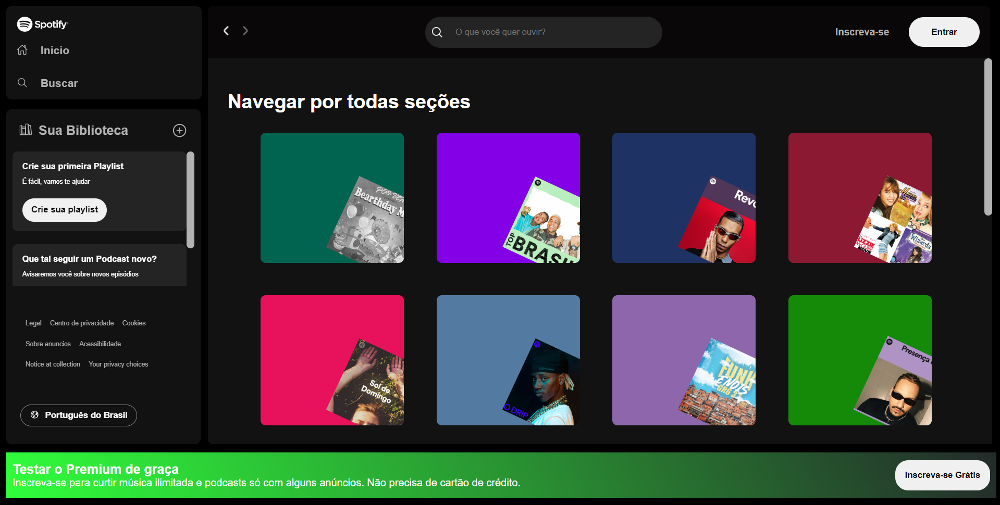

<h1 align="center">Spotify</h1>

    Criei e implmentei o Site do Spotify, visando na melhoria do meu conhecimnto com uma Api fake, onde podemos fazer busca em um pequeno banco de dados criado com JSON. 
     

    

## 🛸 Tecnologias

Esse projeto foi desenvolvido com as seguintes tecnologias:

- HTML e CSS  
- JavaScript 
- Git e Github  

## 🖥️ Projeto 

- [Da uma olhada ai](https://spotify-imers-o-alura.vercel.app/)

Feito com ♥ by Victor Lima
